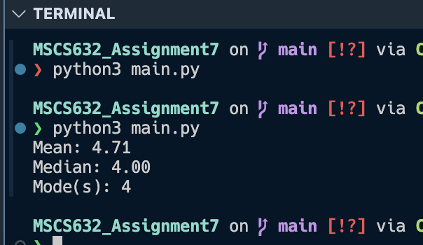

# MSCS632_Assignment7
## Setup
- **Step 1:** Download python https://www.python.org/downloads/
- **Step 2:** Download C
- **Step 3:** Download OCaml

## Output
When running with the following command
```
python3 main.py
```
the application will show the result after scheduling the shift based on employee's preferences and randomly
